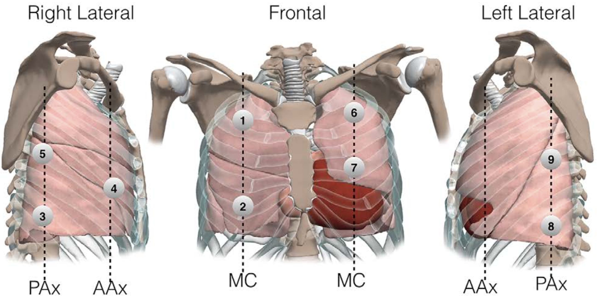
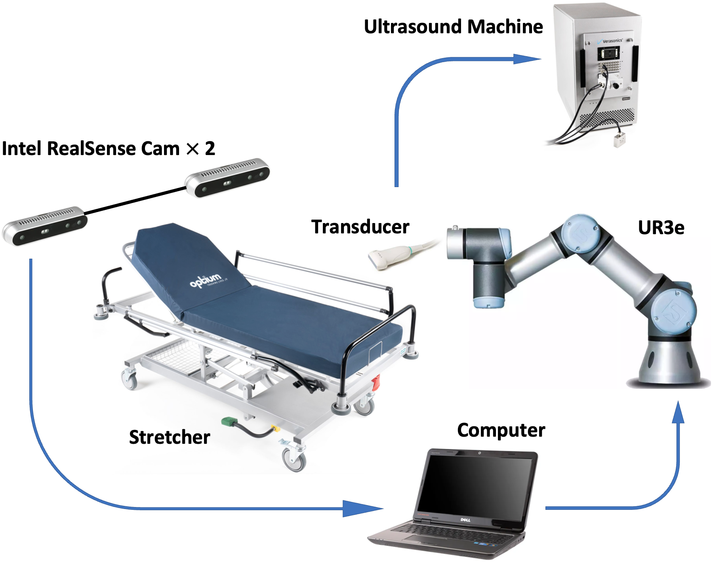
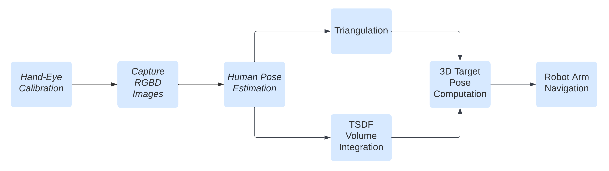

# Autonomous Transducer Positioning System for Lung Ultrasound Scan

### 9 scan target locations (we focus on target 1,2,4):

### Apparatus setup:

### Pipeline:

## Contributors
| Name  | Email |
| ------------- | ------------- |
| Jianzhi Long  | jlong@ucsd.edu |
| Jicang Cai  | j1cai@ucsd.edu  |

## Acknowledge
We acknowledge the excellent implementation from [ViTPose](https://github.com/ViTAE-Transformer/ViTPose), [OpenPose](https://github.com/CMU-Perceptual-Computing-Lab/openpose), and Rope Robotics (Denmark).
