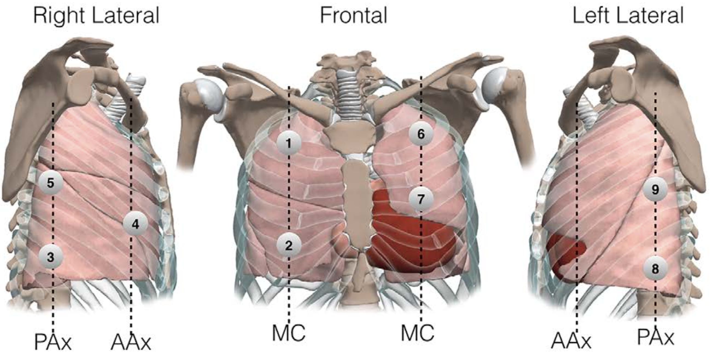
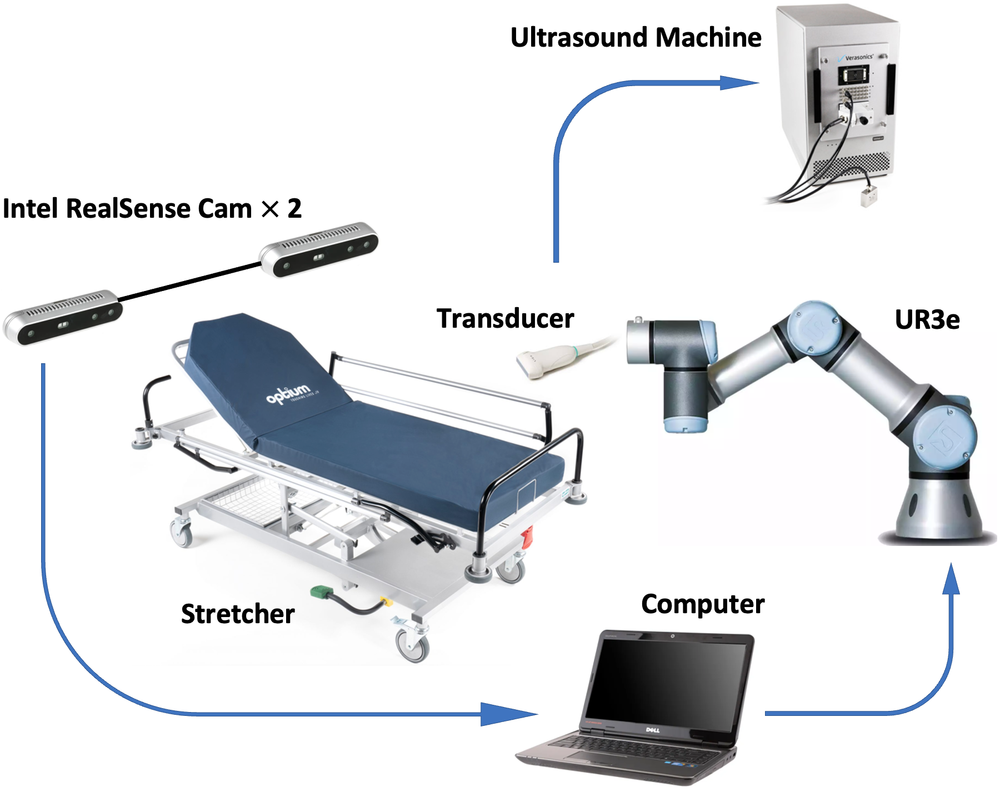
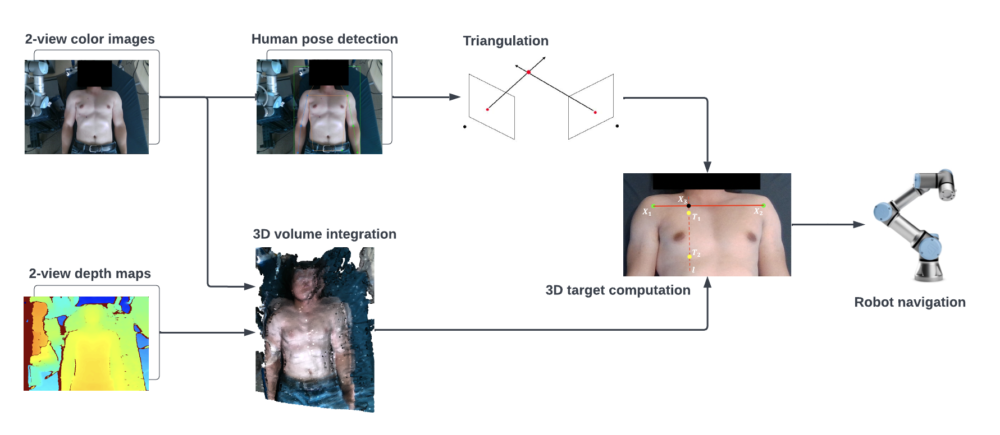

<h1 align="center">Localizing Scan Targets from Human Pose for Autonomous Lung Ultrasound Imaging</h1>

<h4 align="center">This is the official repository of the paper <a href="">Localizing Scan Targets from Human Pose for Autonomous Lung Ultrasound Imaging</a>.</h4>
<h5 align="center"><em>Jianzhi Long1&#8727;, Jicang Cai1&#8727;, and Truong Nguyen1</em></h5>
<h6 align="center">University of California San Diego </h6>

  <a href="#introduction">Introduction</a> |
  <a href="#scan-targets">Scan Targets</a> |
  <a href="#system-components">System Components</a> |
  <a href="#pipeline">Pipeline</a> |
  <a href="#how-to-run-the-code">Run Code</a> |
  <a href="#results-demo">Results Demo</a> |
  <a href="#contact-info">Contact Info</a> |
  <a href="#statement">Statement</a> |
  <a href="#acknowledge">Acknowledge</a>

## Introduction
This repository contains the code, experiment results and a video demo for the paper Localizing Scan Targets from Human Pose for
Autonomous Lung Ultrasound Imaging. Scan target localization is defined as moving the Ultrasound (US) transducer probe to the proximity of the target scan location. We combined a human pose estimation model with a specially designed interpolation model to predict the lung ultrasound scan targets, while multi-view stereo vision is deployed to enhance the accuracy of 3D target localization.

We have released the code for [implementation](src) of our proposed [pipeline](#Pipeline) with the [system setup](#SystemSetup) shown below, as well as the [evaluation](src/evaluation) of the system performance. We also included a short [video demo](#DemoVideo) of localizing the scan target on a human subject to show the system in action.  

## Scan Targets:

In our project, we focus on localizing scan targets 1, 2, and 4.

## System Components:

## Pipeline:

## How to Run the Code
Detailed instructions of running the code are included in other `README.md` files:
- To perform one scanning trial, see <a href="https://github.com/JamesLong199/Autonomous-Transducer-Project/tree/main/src">`src/README.md`</a>.
- To evaluate results, see <a href="https://github.com/JamesLong199/Autonomous-Transducer-Project/tree/main/src/evaluation">`src/evaluation/README.md`</a>.

## Results Demo 
https://user-images.githubusercontent.com/66498825/187047342-1848f07d-ceaf-44e0-8098-28f5038e718b.mp4

## Installation
- URBasic 
- ViTPose
- OpenPose

## Contact Info
| Name  | Email |
| ------------- | ------------- |
| Jianzhi Long  | jlong@ucsd.edu |
| Jicang Cai  | j1cai@ucsd.edu  |

## Acknowledge
We acknowledge the excellent implementation from [ViTPose](https://github.com/ViTAE-Transformer/ViTPose), [OpenPose](https://github.com/CMU-Perceptual-Computing-Lab/openpose), and Rope Robotics (Denmark).

## Statement